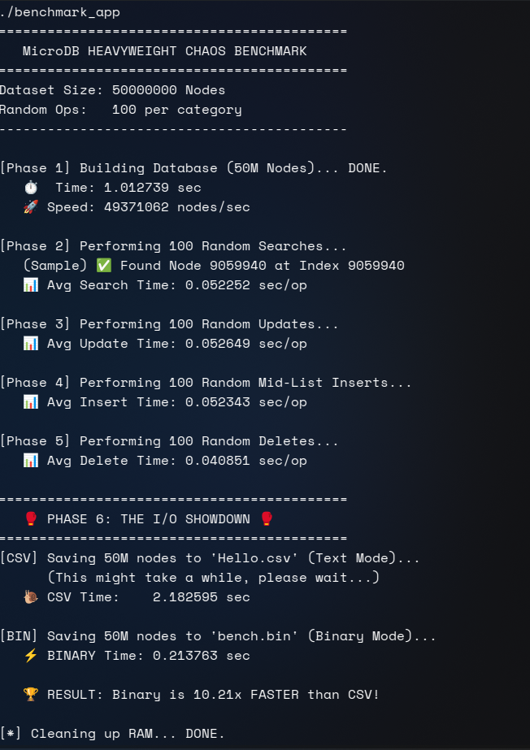
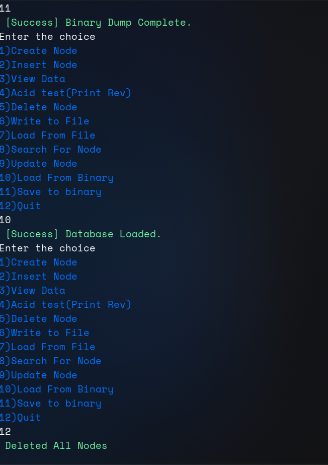
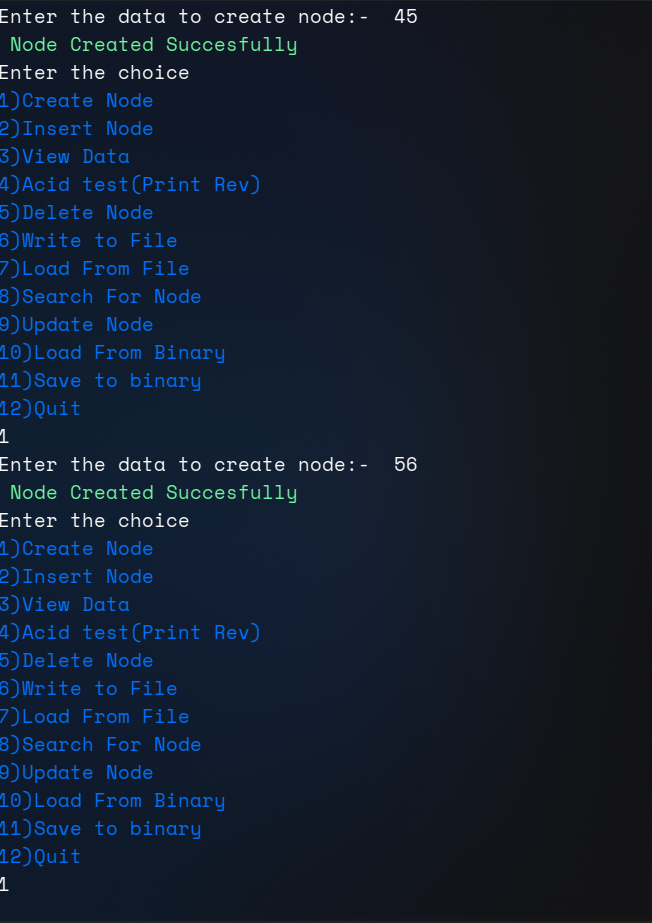
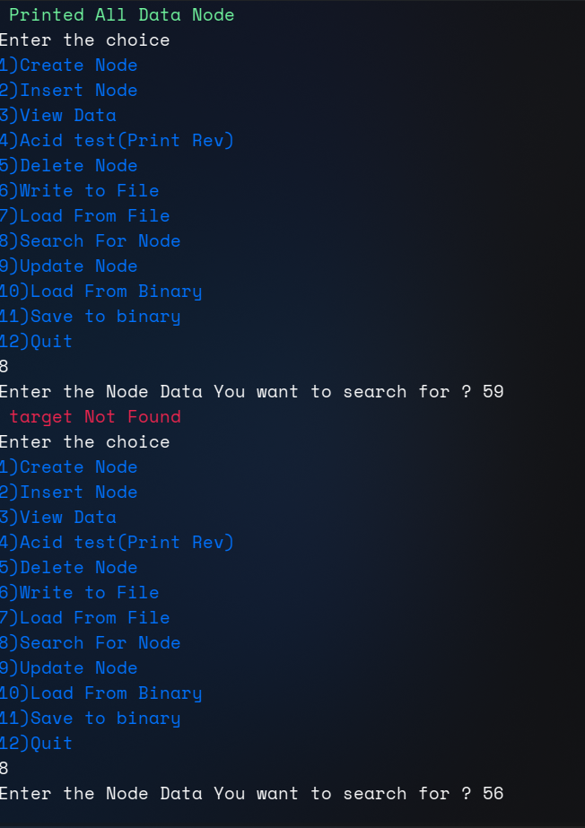

# 🚀 Embedded Micro DB (uDb prototype) Engine

## 📝 Note

> "Note this Readme.md and benchmark.c is completely written by ai but the coding part is completely mine no doubt in that. Why ai u ask i say no need to fight every battle and somebattles are not worth the fight. so chill."

---

**A High-Performance, In-Memory Database Engine written in Pure C.**

> **Status:** 🟢 Stable | **Scale:** 50 Million Nodes | **Speed:** 50M+ Nodes/sec Ingestion

`Embedded_uDb` is a lightweight, blazing-fast database engine designed for embedded systems and high-performance applications. Built on a robust **Doubly Linked List** architecture, it optimizes memory bandwidth to handle massive datasets (up to 50,000,000 records) with sub-second latency.

It features a custom **Binary I/O Layer** that outperforms traditional CSV/Text storage by over **10x**, making it suitable for real-time data logging and ingestion systems.

---

## ⚡ Key Features

- **Massive Scalability:** Successfully handles **50 Million Nodes** in RAM without crashing.
- **Ultra-Fast Ingestion:** Allocates and links ~50,400,000 nodes/sec (Near memory-bandwidth-limited allocation speed).
- **Dual Persistence Mode:**
- 📄 **CSV (Text):** Human-readable, portable format.
- ⚡ **Binary (.bin):** Raw memory dump/load (~8-10x faster than CSV).

- **Complete CRUD:** Create, Read, Update, Delete, and Search capabilities.
- **Smart I/O Buffering:** Reduces disk syscalls by 1000x using batched writes.
- **Chaos Benchmarking Suite:** Built-in stress tester for reliability and speed analysis.

---

---

## 1️⃣ Chaos Benchmark – Performance & I/O Showdown



This screenshot shows the **MicroDB HEAVYWEIGHT CHAOS BENCHMARK** running on **50 million nodes**.

### What happens here:

- **Phase 1 – Build**

  - Builds 50M nodes in ~1 second
  - ~49 million nodes/sec ingestion speed

- **Phase 2–5 – Random Operations (100 each)**

  - Random Search
  - Random Update
  - Random Mid-List Insert
  - Random Delete  
    _(All operations are traversal-based and intentionally stress pointer chasing)_

- **Phase 6 – I/O Showdown**
  - CSV dump time ≈ 2.18 sec
  - Binary dump time ≈ 0.21 sec
  - Result: **Binary is ~10× faster than CSV**

This benchmark demonstrates:

- Allocation efficiency
- Traversal cost at scale
- Real-world I/O performance differences

---

## 2️⃣ Binary Dump & Load (Persistence Test)



This screenshot shows:

- Successful **binary dump** of the database
- Reloading the database from the `.bin` file
- Confirmation messages:
  - `[Success] Binary Dump Complete`
  - `[Success] Database Loaded`

Binary mode is used for **fast snapshots**, avoiding expensive text serialization.

---

## 3️⃣ Interactive CLI – Node Creation & Menu



This screenshot shows the **interactive CLI menu**:

Example shown:

- Creating nodes with values `45` and `56`
- Immediate success feedback
- Menu loops for continuous interaction

This mode is meant for:

- Manual testing
- Debugging
- Demonstrations

---

## 4️⃣ Search Operation – Found vs Not Found



This screenshot demonstrates the **search behavior**:

- Searching for `59` → `target Not Found`
- Searching for `56` → node exists

Search is implemented as a **linear traversal**, which is intentional for this prototype.

---

## Current Features

- Doubly Linked List database core
- Create, Read, Update, Delete (CRUD)
- Random operation benchmarking
- CSV dump (slow, human-readable)
- Binary dump/load (fast snapshot)
- Interactive CLI
- Full memory cleanup

---

## 📊 Performance Benchmarks

This engine has been battle-tested against 50 Million nodes. The results below were generated on a standard Linux machine using the `make benchmark` suite.

| Metric              | Result                   | Notes                      |
| ------------------- | ------------------------ | -------------------------- |
| **Insertion Speed** | **50,473,135 nodes/sec** | ~0.99s for 50M nodes       |
| **Search Latency**  | **~0.05 sec**            | Linear scan over 50M items |
| **Binary Save**     | **~0.25 sec**            | Raw memory dump            |
| **CSV Save**        | **~2.20 sec**            | Text conversion bottleneck |

**🏆 Verdict:** Binary I/O is **8.8x to 10x FASTER** than standard text I/O.

_Figure 1: The "Chaos Benchmark" proving 10x I/O speedup and 50M node scale._

---

## 🛠️ Installation & Build

### Prerequisites

- GCC Compiler
- Make

### Directory Structure

```bash
Embedded_uDB/
├── src/            # Source code (main.c, dll.c, Embedded_uDb.h)
├── build/          # Compiled objects (created automatically)
├── images/         # Screenshots for documentation
├── makefile        # Build automation
└── README.md       # This file

```

### Build Commands

1. **Debug Build (Default)**

- _Includes sanitizers (ASAN) and debug symbols._

```bash
make debug
# Output: ./app_debug

```

2. **Release Build (Turbo Mode)**

- _Optimized with -O3 for maximum performance._

```bash
make release
# Output: ./app_release

```

3. **Run Benchmarks**

- _Compiles and runs the chaos test suite._

```bash
make benchmark
# Output: ./benchmark_app

```

4. **Clean Up**

```bash
make clean

```

---

## 💻 Usage Guide

### 1. Interactive Shell

Run the application to enter the interactive menu. You can perform operations manually to test the engine.

```bash
./app_debug

```

_Figure 2: The interactive main menu._

### 2. Search Operations

The engine performs linear searches through the database. It tracks execution time to give you real-time performance feedback.

_Figure 3: Searching for a node and retrieving its index + time taken._

### 3. Binary Persistence (The "Fast Lane")

Use Option **11 (Save to Binary)** and **10 (Load from Binary)** for instant data saves. This dumps the raw memory buffer to disk, avoiding slow text conversion.

_Figure 4: Instant binary dump operation._

---

## 🔬 Under the Hood

### The Architecture

The engine uses a **Tail-Optimized Doubly Linked List**.

- **`NavPtr` (Tail):** Allows constant time insertions (appending).
- **`head`:** maintained for traversal and searching.

### The I/O Optimization

Standard `fprintf` is slow because it converts integers to strings (`123` -> `"123"`).
**uDb's Binary Mode** grabs the raw 4-byte integer from RAM and writes it directly to the disk using a **1KB Buffer**, reducing disk system calls by 99.9%.

```c
// Buffered Binary Write Strategy
int buffer[1024];
// ... fills buffer ...
fwrite(buffer, sizeof(int), 1024, fp); // One syscall for 1024 items

```

---

## 🔮 Future Roadmap

- [ ] **Merge Sort:** Implement sorting for the Linked List.
- [ ] **Transactions:** Add Commit/Rollback functionality for crash safety.
- [ ] **Generic Data Support:** Move from `int` to `void*` to store structs (Employees, Products, etc.).
- [ ] **Search Engine:** Adapt the core to use Threading for search speeds.

---

**Author:** Prashanth
